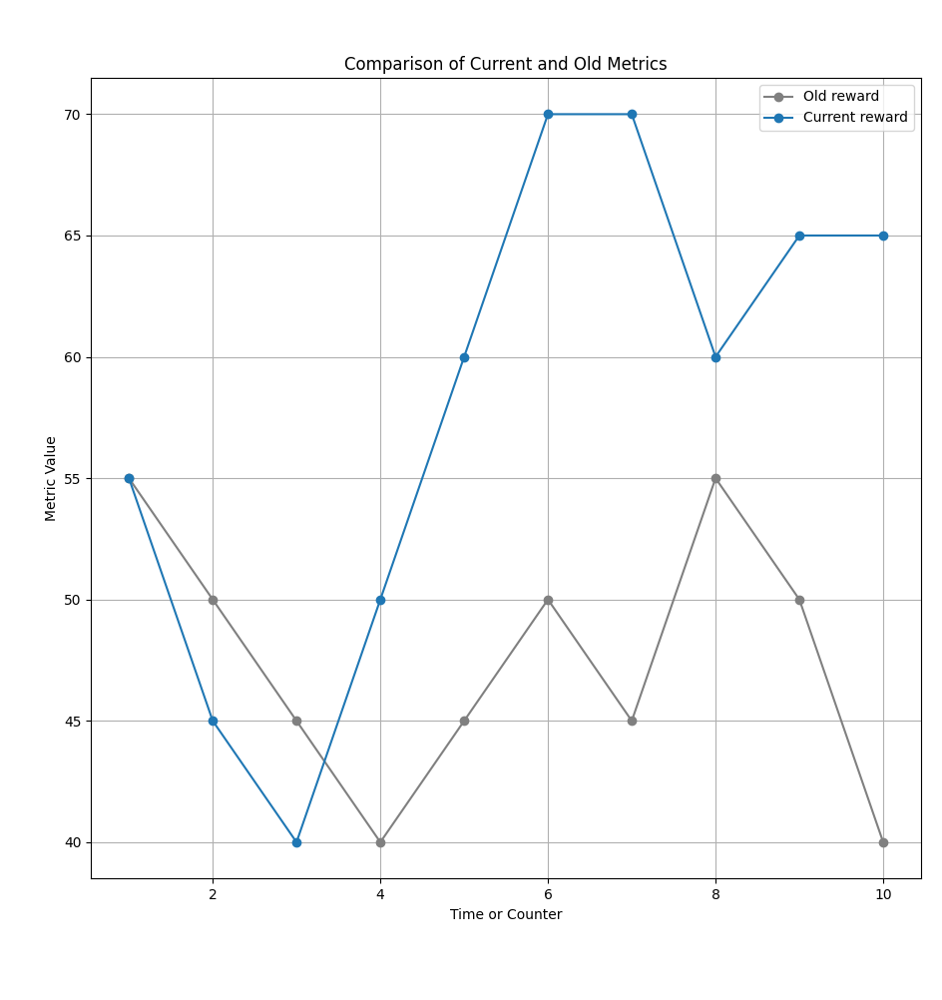
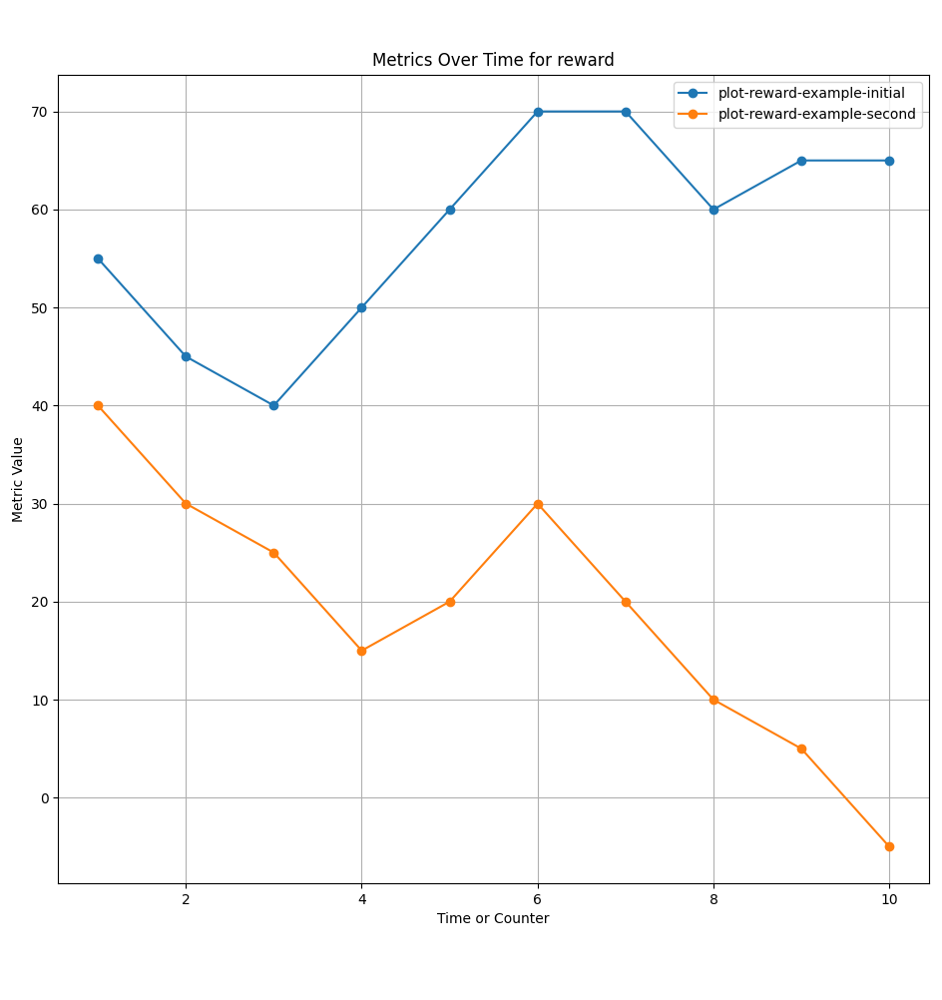

# MetricTracker

The `MetricTracker` is a versatile Python module designed for logging and visualizing metrics over time, useful for tracking performance metrics in various applications. Whether you're developing algorithms, training machine learning models, or monitoring system performance, `MetricTracker` helps you record, analyze, and compare metrics across different sessions.

## Features

- **Simple Metric Logging**: Easily log any number of user-defined metrics.
- **Dynamic Visualization**: Plot current metrics and compare them with data from previous sessions.
- **Git Integration**: Use git tags to manage different versions of metrics logs for comprehensive tracking and historical comparison.

## Usage

### Basic Usage

1. **Initialize the Tracker**: Specify the metrics you want to track.

   ```python
   from metric_tracker import MetricTracker
   mt = MetricTracker(['episode_num', 'reward'])
   ```

2. **Log Metrics**: Record metrics data during your session.

   ```python
   mt.log_metrics(1, 50)  # Log episode 1 with a reward of 50
   mt.log_metrics(2, 75)  # Log episode 2 with a reward of 75
   ```

3. **Visualize Metrics**: Plot the recorded metrics.

   ```python
   mt.plot_current_metrics()
   ```

### Comparing Sessions

- **Plot Comparison**:

  ```python
  mt.plot_comparison()  # Compare current and previous (old) session metrics
  ```

### Visual Examples

- **Current and Previous Session Comparison**

  

- **Collecting and Visualizing Metrics From Git Tags**

  
