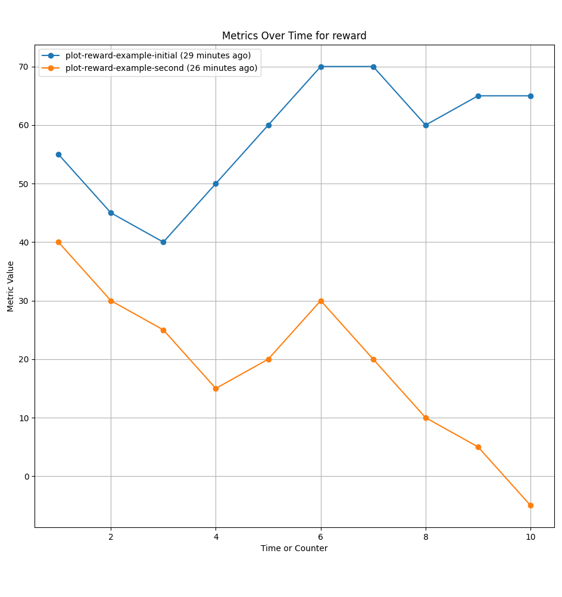

# MetricTracker

The `MetricTracker` is a versatile Python module designed for logging and visualizing metrics over time, useful for tracking performance metrics in various applications. Whether you're developing algorithms, training machine learning models, or monitoring system performance, `MetricTracker` helps you record, analyze, and compare metrics across different sessions.

## Features

- **Simple Metric Logging**: Easily log any number of user-defined metrics.
- **Dynamic Visualization**: Plot current metrics and compare them with data from previous sessions.
- **Git Integration**: Use git tags to manage different versions of metrics logs for comprehensive tracking and historical comparison.

## Installation

The simplest way to install MetricTracker is to clone `MetricTracker.py` in your project's directory. Then get right to work!

## Usage

### Basic Usage

1. **Initialize the Tracker**: Specify the metrics you want to track.

   ```python
   from MetricTracker import MetricTracker
   mt = MetricTracker(['episode_num', 'reward'])
   ```

2. **Log Metrics**: Record metrics data during your session.

   ```python
   mt.log_metrics(1, 50)  # Log episode 1 with a reward of 50
   mt.log_metrics(2, 75)  # Log episode 2 with a reward of 75
   ```

3. **Visualize Metrics**: Plot the recorded metrics.

   ```python
   mt.plot_current_metrics()
   ```

### Comparing Sessions

- **Plot Comparison**:

  ```python
  mt.plot_comparison()  # Compare current and previous (old) session metrics
  ```
  

### Visualizing Metrics from Git Tags

1. **Tag Your Metrics Commit**: After updating your metrics, tag your commit to make it retrievable:

   ```bash
   git add metrics_log.csv
   git commit -m "Updated metrics log"
   git tag -a plot-unique-tag-name-initial-test -m "Description of the data or session"
   ```

2. **Retrieve and Plot Tagged Data**: Use the `MetricTracker.py` script to fetch and visualize metrics:

   ```bash
   python MetricTracker.py unique-tag-name
   ```

   Replace `unique-tag-name` with the tag name excluding the `plot-` prefix. The script fetches all related tags, compiles their data, and plots them for comparison.

  
